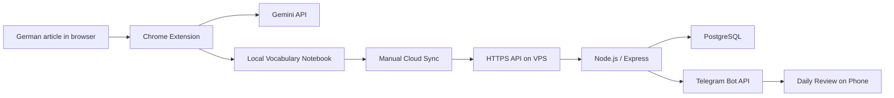
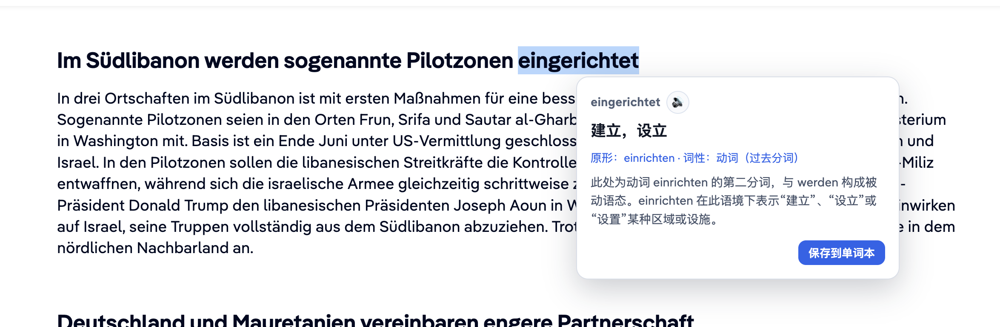
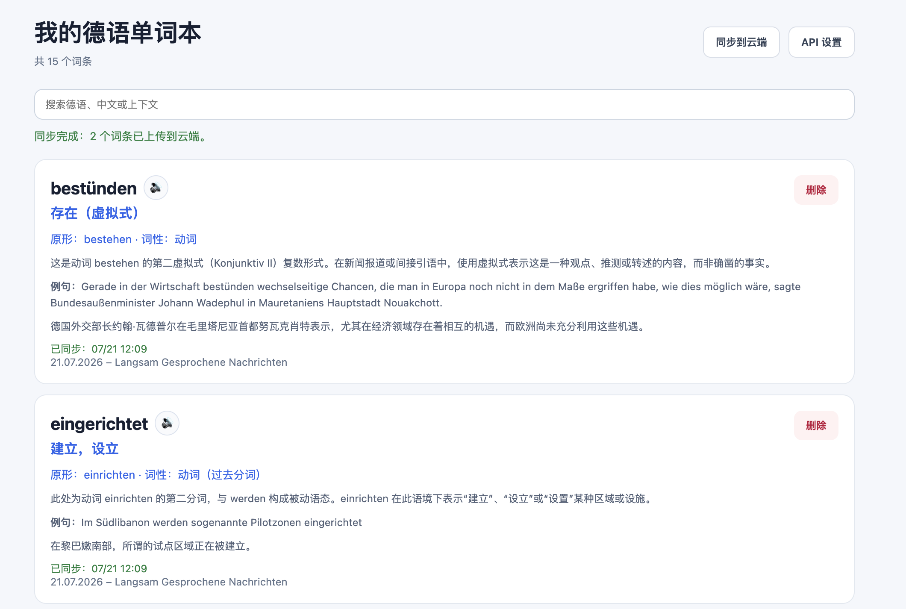
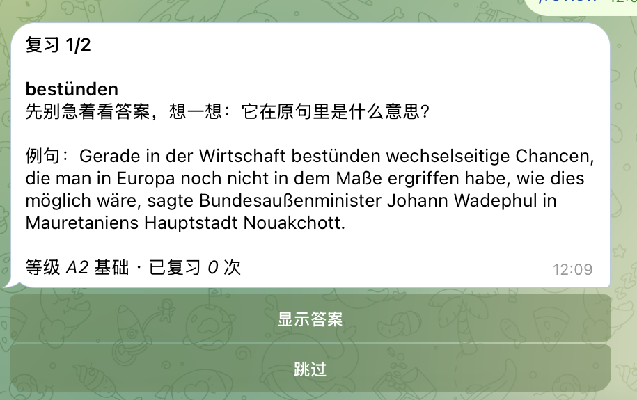
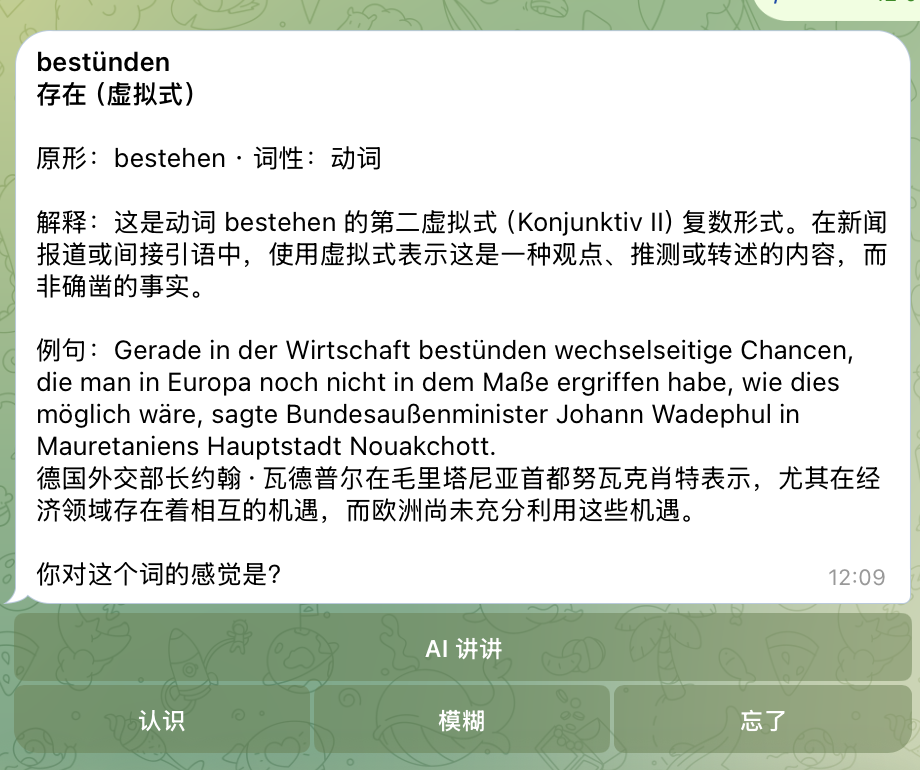
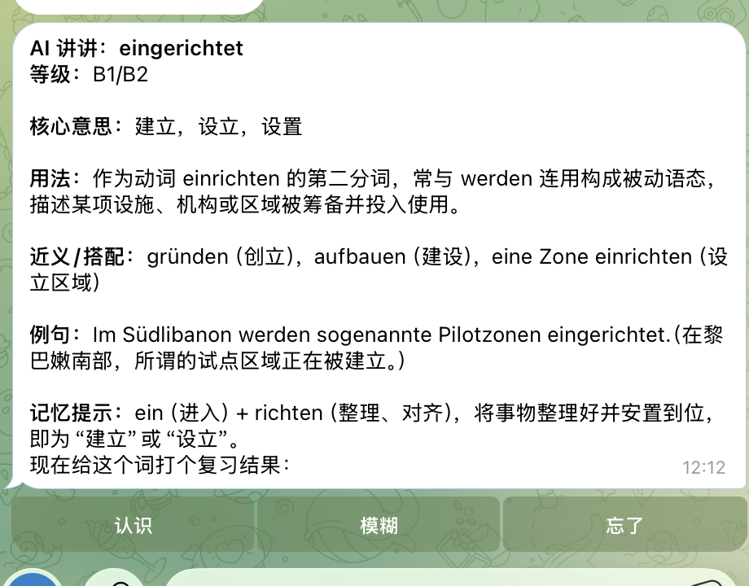

# German Vocab Extension

A Chrome extension and cloud review system for learning German while reading online articles.

The project started from a real learning problem: when reading German news or articles, unknown words are easy to translate once, but hard to save, review, and remember later. This extension keeps the reading flow simple: select a German word, get a context-aware Chinese explanation, save it locally, sync it to a cloud vocabulary notebook, and receive review messages through Telegram.

## Project Highlights

- Chrome Extension Manifest V3 for selecting and translating German text on any webpage.
- Context-aware Chinese explanations powered by the Gemini API.
- Local vocabulary notebook with search, delete, pronunciation, duplicate protection, and source context.
- Manual cloud sync from the extension to a private Node.js backend.
- PostgreSQL storage for cloud vocabulary entries.
- Telegram Bot integration for daily vocabulary review messages.
- Interactive review buttons, `/review` and `/stats` commands, and optional AI explanations.
- VPS deployment with HTTPS reverse proxy via Caddy.
- GitHub-based workflow: local development, versioned commits, deployment through `git pull` on the VPS.

## Why I Built This

**English:** I built this project while preparing for an IT Ausbildung in Germany. It solves a real learning problem I have every day: saving useful German vocabulary directly from articles and reviewing it later without breaking the reading flow.

**Deutsch:** Ich habe dieses Projekt während meiner Vorbereitung auf eine IT-Ausbildung in Deutschland entwickelt. Es löst ein konkretes Lernproblem: deutsche Vokabeln direkt beim Lesen von Artikeln speichern, mit Kontext wiederholen und später über Telegram erneut lernen.

## Architecture



More details: [docs/architecture.md](docs/architecture.md)

## Features

### Browser Extension

- Automatic translation after selecting German text on a webpage.
- Context-aware explanations for native Chinese speakers learning German.
- German pronunciation through the browser's Web Speech API.
- Local vocabulary notebook with search and delete.
- Saves source title, source URL, example sentence, and Chinese explanation.
- Duplicate protection for already saved words from the same page.
- Local caching to reduce repeated Gemini API calls.
- Manual cloud sync button for uploading saved words to the VPS backend.

### Cloud Backend

- Private REST API for storing vocabulary in PostgreSQL.
- `API_SECRET` header for the first private deployment.
- HTTPS endpoint through Caddy reverse proxy.
- Interactive Telegram review bot with answer reveal, review ratings, statistics, and optional AI explanations.
- PostgreSQL review metadata for difficulty, review count, next review date, and last result.

## Screenshots

### Translate German in context



### Local vocabulary notebook and cloud sync



### Telegram review flow

<p align="center">
  
  
</p>

### Optional AI explanation

<p align="center">
  
</p>

The screenshots show the implemented browser-to-cloud review flow. A capture and privacy checklist is available in [docs/screenshots.md](docs/screenshots.md).

## Tech Stack

- Chrome Extension Manifest V3
- JavaScript, HTML, CSS
- Gemini API
- `chrome.storage.local`
- Web Speech API
- Node.js / Express
- PostgreSQL
- Docker
- Caddy HTTPS reverse proxy
- Telegram Bot API
- VPS deployment

## Project Structure

```text
german-vocab-extension/
  manifest.json          # Chrome extension entry
  background.js          # Gemini API calls and caching
  content.js             # Text selection popup
  options.html/js        # Gemini and cloud sync settings
  words.html/js          # Local notebook and manual cloud sync
  server/                # Cloud API, PostgreSQL access, Telegram review bot
  docs/                  # Architecture, deployment, privacy, roadmap
```

The extension still runs from the repository root. The `server/` folder contains the backend that is deployed separately on the VPS.

## Local Installation

1. Open `chrome://extensions`.
2. Enable Developer mode.
3. Click "Load unpacked".
4. Select this project folder.
5. Open the extension options page.
6. Add your Gemini API key and model name.
7. Optional: enable cloud sync and add your backend URL plus API secret. Chrome requests access only to the configured backend origin when the first sync starts.
8. Refresh a German article page and select a word.

## Cloud Deployment

The backend is designed for a private VPS deployment:

```text
Chrome Extension
-> https://your-domain/vocab/api/words
-> Caddy reverse proxy
-> Node.js / Express server on localhost:3000
-> PostgreSQL
-> Telegram Bot API
```

Deployment notes: [docs/deployment.md](docs/deployment.md)

## Security And Privacy

- Gemini API keys are stored only in the user's local browser storage.
- Telegram Bot tokens, database passwords, and API secrets are stored only in server-side `.env` files.
- `.env` files are ignored by Git and must never be committed.
- The extension sends selected text and context to the configured Gemini model for translation.
- Only saved vocabulary entries are synced to the cloud backend.

More details: [docs/privacy.md](docs/privacy.md)

## Application Summary

For an Ausbildung application, this project can be described as:

> Personal learning project: a Chrome extension for German vocabulary learning with local storage, cloud synchronization, PostgreSQL backend, HTTPS deployment on a VPS, and Telegram-based review reminders.

German version:

> Eigenes Lernprojekt: Chrome-Erweiterung zum Deutschlernen mit lokaler Speicherung, Cloud-Synchronisation, PostgreSQL-Backend, HTTPS-Deployment auf einem VPS und Telegram-Erinnerungen zur Wiederholung.

More phrasing for CV and interviews: [docs/application-summary.md](docs/application-summary.md)

## Roadmap

See [docs/roadmap.md](docs/roadmap.md).

## License

MIT
