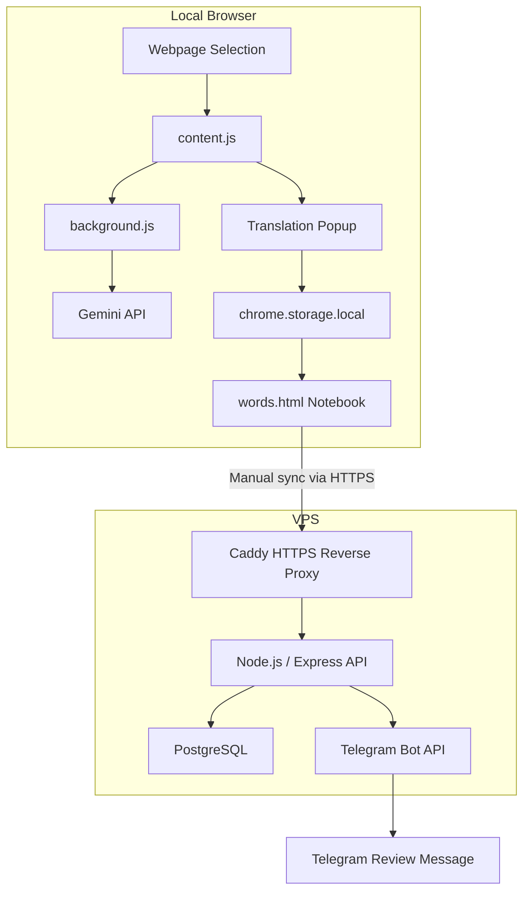

# Architecture

## Overview

German Vocab Extension is split into two parts:

- A Chrome extension that supports reading, translating, pronunciation, local storage, and manual cloud sync.
- A private cloud backend that stores vocabulary in PostgreSQL and sends Telegram review messages.



## Request Flow

### Translation Flow

```text
Selected German text
-> content script extracts text and context
-> background service worker calls Gemini API
-> structured explanation is rendered in the popup
-> user saves the word locally
```

### Cloud Sync Flow

```text
Local vocabulary notebook
-> user clicks sync
-> extension sends unsynced words to HTTPS API
-> Caddy forwards request to Express backend
-> backend stores or updates the word in PostgreSQL
```

### Review Flow

```text
Scheduler on backend
-> selects review words from PostgreSQL
-> formats a Telegram message
-> sends it through Telegram Bot API
-> user receives review prompt on phone
```

## Main Components

- `manifest.json`: extension metadata, permissions, host permissions, content script registration.
- `content.js`: detects selected German text, extracts context and example sentences, renders the translation popup.
- `background.js`: calls the Gemini API, normalizes structured translation results, and caches repeated requests.
- `options.html` / `options.js`: stores Gemini settings, voice settings, and cloud sync settings in `chrome.storage.local`.
- `words.html` / `words.js`: displays the local vocabulary notebook with search, delete, pronunciation, sync status, and manual cloud sync.
- `server/`: Node.js backend for the cloud vocabulary notebook, PostgreSQL storage, and Telegram review messages.
- `server/migrations/`: SQL migrations for database schema setup.

## Data Storage

### Local Browser Storage

The extension uses `chrome.storage.local` for:

- Gemini API key and model name.
- German voice preference.
- Cloud sync API URL and API secret.
- Saved vocabulary entries.
- Local sync status such as `cloudSyncedAt`.

### PostgreSQL

The cloud backend stores synced vocabulary in the `words` table. It currently contains vocabulary metadata such as:

- Original German word or phrase.
- Chinese translation.
- Base form, part of speech, article, plural.
- Explanation and context sentence.
- Source URL and source title.
- Creation and review timestamps.

Future review algorithm fields can include:

```text
review_count
difficulty
next_review_at
last_reviewed_at
last_result
```

## Deployment Shape

```text
Public internet
-> https://sea1.ktno.cc/vocab/*
-> Caddy container on VPS
-> http://127.0.0.1:3000/*
-> Node.js server managed by PM2
-> PostgreSQL Docker container
```

## Deutsch

German Vocab Extension besteht aus einer Chrome-Erweiterung und einem privaten Backend. Die Erweiterung bleibt lokal nutzbar, waehrend das Backend Cloud-Synchronisation, PostgreSQL-Speicherung und Telegram-Wiederholungen ermoeglicht.

```text
Chrome-Erweiterung
-> lokale Speicherung
-> manuelle Cloud-Synchronisation
-> Express API auf dem VPS
-> PostgreSQL
-> Telegram Bot
```
